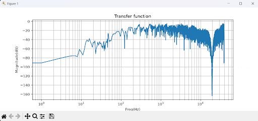
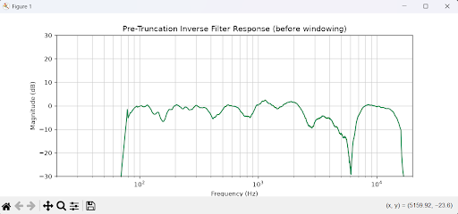
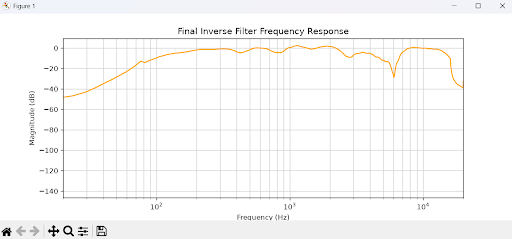
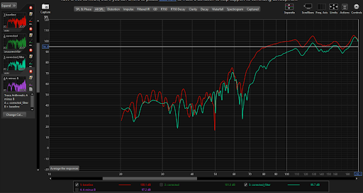
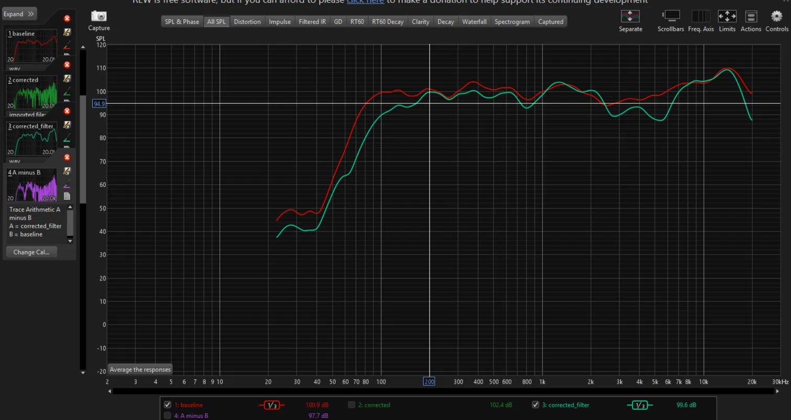
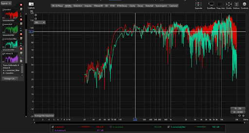

# Room Correction DSP: Python Toolchain

**Author:** Van-Dyck Adanuty

Welcome to the documentation for the Room Correction DSP pipeline. This toolchain handles the mathematical heavy lifting of physical room correction: extracting an acoustic signature from a physical space, calculating a stable inverse filter, and formatting the data for zero-latency execution in a C++ (JUCE) convolution engine.

This architecture is built on the philosophy of systematic isolation. By stripping the acoustic mathematics down to their absolute bare bones and verifying each piece independently, the pipeline guarantees causality, mathematical stability, and strict host-compliance without relying on black-box external libraries.

---

## The Architectural Philosophy

In digital signal processing, mathematical perfection often directly conflicts with physical reality. Calculating a "perfect" inverse of a room yields an unstable, non-causal filter that causes severe pre-ringing, destroys transients, and possesses a microscopic physical "sweet spot."

This toolchain bridges the gap between theoretical math and acoustic engineering by rigorously enforcing physical boundaries:

1. **Truncating acoustic chaos** by focusing exclusively on early reflections.
2. **Splitting correction strategy at the Schroeder frequency**, treating room modes and diffuse reverberation as physically distinct problems.
3. **Eliminating mathematical pre-ringing** using custom asymmetric windowing.
4. **Preventing out-of-band amplification** through frequency-dependent denominator stabilization and a hard gain ceiling.

---

## Phase 1: Acoustic Capture & Deconvolution

The pipeline begins by translating the physical room into pure mathematical data.

### The Mechanism

A logarithmic sine sweep is played through a speaker and captured via a measurement microphone. The script does not use the raw recording; instead, it extracts the pure impulse response (IR) of the room through frequency-domain deconvolution.

$$H_{room} = \text{IFFT}\left( \frac{\text{FFT}(Recording) \cdot \text{FFT}(Sweep)^*}{\lvert\text{FFT}(Sweep)\rvert^2 + \epsilon} \right)$$

- **Regularization Epsilon $$(\epsilon = 1e-3)$$:** Added to the magnitude of the sweep to prevent division-by-zero errors in regions where the speaker lacks physical energy (e.g., sub-bass). This stabilizes near-zero frequencies and prevents high-frequency noise blowout.

### Zero-Phase Time Alignment

Before the Real FFT is taken, the exact peak of the physical impulse response is anchored to index 0, and the tail is circularly wrapped. This mathematically treats the direct sound as arriving at t = 0, preventing a time-of-flight phase explosion and preserving a sharp transient response instead of letting high frequencies wrap chaotically.

Baseline verification for this stage came from raw REW sweep captures (with all master-bus effects bypassed) — the SPL and phase plots exposed the room's actual physical behavior: high-Q sub-bass modes below roughly 80 Hz, and dense, chaotic comb filtering above it. That empirical boundary is what defines the Schroeder frequency used throughout the rest of the pipeline.

---

## Phase 2: Selective Fractional-Octave Smoothing

Raw high-frequency data is dominated by comb filtering — hundreds of microscopic, physically unfixable peaks and nulls caused by direct sound colliding with early reflections. Attempting to invert these directly would mean chasing noise rather than correcting the room.

- **Methodology:** Complex frequency-domain values are averaged in 1/3-octave bands, flattening chaotic amplitude and phase wraps into the broad acoustic trend.
- **Selective Bypass:** Smoothing is explicitly skipped below the ≈80 Hz Schroeder frequency and above 20 kHz. Below the Schroeder point, the room behaves as a small number of distinct, high-Q resonant modes — smoothing them away would erase the exact frequencies that need surgical correction. Above 20 kHz, there's nothing meaningful left to smooth.

This selective-bypass logic is what separates "raw bass inversion" from "smoothed treble inversion" — two different acoustic regimes get two different treatments.

---

## Phase 3: Mathematical Inversion (Kirkeby)

Once the (selectively smoothed) room IR is extracted, the engine calculates the exact counter-frequencies necessary to neutralize it.

### The Classroom Trap vs. Kirkeby Regularization

In a standard academic DSP environment, the inverse transfer function is taught as an elegant, straightforward equation:

$$H_{inv} = \frac{1}{H_{room}}$$

Applying this textbook theory to a physical room results in immediate, catastrophic clipping. Real rooms have deep acoustic nulls — frequencies that violently cancel each other out. If the microphone captures near-zero energy at 150 Hz, the theoretical formula attempts to divide by zero, demanding infinite gain from the speakers.

To bridge the gap between classroom theory and physical reality, this pipeline abandons the pure inverse and employs Kirkeby Regularization, calculating a least-squares optimized inverse filter:

$$H_{inv} = \frac{H_{room}^*}{\lvert H_{room}\rvert^2 + \beta(f)}$$

### From a Flat Constant to a Dynamic Beta Array

The first working version of this pipeline used a single flat \beta = 0.1 everywhere. That's a safe floor, but it's a blunt instrument: it protects the extremes but also mutes precision in the midrange, where the room is most correctable and the ear is most sensitive.

The current implementation replaces the flat constant with a frequency-dependent `beta_array`:

- **`β ≈ 0.1` at the extremes** (deep sub-bass and ultra-treble) — these are regions with mostly unfixable acoustic nulls, so the filter is deliberately conservative to protect the monitors from runaway gain.
- **`β ≈ 0.005` through the midrange** — a much lighter touch, letting the filter make precise, confident corrections where the room's behavior is well-defined and correction actually matters perceptually.

### The Brickwall Ceiling

As a final, unconditional failsafe independent of the Kirkeby math, the anchored magnitude output is passed through `np.clip` with a hard **+12 dB maximum boost**. Regardless of what the beta array allows upstream, no single frequency can be amplified past this ceiling — protecting both the digital bus headroom and the physical monitors.

### Decoupling Tone from Physics

Earlier iterations folded a Harman-style target curve (a cosine bass shelf plus a logarithmic treble tilt) directly into the inversion math. That coupling was removed. The plugin's scope is now strictly acoustic physics correction — flattening what the room does to the signal. Tonal preference and bass warmth are treated as a separate, downstream concern, left to master-bus EQ. This mirrors how correction and taste are kept separate in professional mixing workflows.

---

## Phase 4: The Physical-Digital Boundary

The raw output of the Kirkeby inversion is mathematically correct but physically unusable. It contains wrap-around artifacts, destructive pre-ringing, and uncorrectable late-stage reverberation. The pipeline applies three strict transformations.

### 1. The 8192-Sample Truncation (Spatial Stability)

The raw inverted signal is aggressively truncated to 8192 samples (~185 milliseconds), split as **1024 pre-transient samples** and **7168 post-transient samples**.

- **Why 8192, and why that split:** Sound travels roughly 1 foot per millisecond, so correcting a full second of chaotic, diffuse room reverb creates a filter with extreme "spatial fragility" — moving your head an inch breaks the phase correction. Truncating to the direct sound and early reflections maximizes the physical sweet spot while keeping CPU overhead minimal. The exact 1024/7168 split was also chosen so the total lands precisely on the 8192-sample power-of-two boundary, which matters for SIMD-aligned convolution performance in the real-time C++ engine (see Engineering Challenges below).

### 2. Circular Time Shift (Causality)

Because FFT operations assume circular, infinitely looping signals, the Kirkeby output wraps "negative time" data around to the end of the array. `np.roll` is used to drag this wrapped data to the center, realigning the main Dirac spike onto a linear timeline.

### 3. Asymmetric Windowing (Transient Clarity)

Phase correction inherently requires pre-ringing (energy that occurs _before_ the main sound). To prevent transients (like snare hits) from sounding metallic or "washed out," an asymmetric Hanning window is applied:

- **Left Side (1024 samples):** An aggressive mathematical gate. It rapidly scales from `0.0` to `1.0`, ruthlessly amputating the pre-ringing right up until the microsecond the physical transient hits.
- **Right Side (7168 samples):** A gentle physical release. It smoothly curves from `1.0` to `0.0`, allowing the physical tail of the room to ring out naturally, preventing DC offsets and spectral leakage.

---

## Phase 5: JUCE C++ Export Compliance

The final filter must be ingested by the JUCE `juce::dsp::Convolution` engine. JUCE's lightweight internal memory parser enforces strict constraints. The Python script formats the data to guarantee instantaneous, static binary compilation.

1. **Strict Stereo Stacking:** The 1D mono filter is vertically stacked (`np.column_stack`) into a `(8192, 2)` matrix to fulfill the strict `Stereo::yes` contract of the C++ convolver.
2. **32-Bit Float Casting:** The stereo matrix is explicitly cast to `np.float32`. This preserves the microscopic structural integrity of the FIR coefficients natively without requiring destructive integer scaling or quantization.
3. **Peak Normalization:** A dynamic guard (`max_amp > 0`) guarantees the filter is peak-normalized, preventing mathematical clipping during live sum-of-products convolution.

### Final Output

The script generates `correction_filter.wav`. This file is not intended to be read from a file system at runtime. It is designed to be injected directly into the VST3 binary via CMake's `juce_add_binary_data` module, effectively turning the mathematical array into a hardcoded C++ memory block.

---

## Filter Characteristics

These plots trace the inverse filter through its own generation pipeline, from raw mathematical inversion to the final windowed, truncated version that ships inside the plugin.

_The raw transfer function of the room, prior to any correction — this is the mathematical starting point the Kirkeby inversion works against._

_The inverse filter's frequency response before windowing and truncation are applied. Note the instability creeping in at the sub-20 kHz edge — exactly the kind of unbounded, unwindowed behavior that Phase 4's asymmetric Hanning window and the +12 dB brickwall ceiling exist to tame._

_The final 8192-sample filter after windowing, truncation, and the brickwall ceiling — this is what actually gets baked into `correction_filter.wav` and injected into the JUCE binary._

---

## Empirical Verification (REW Measurements)

Simulated diagnostics and Python-side plots confirm the filter is mathematically well-behaved, but they can't confirm it's doing anything to the room. The only way to verify that is a physical sweep captured before and after the plugin is inserted, measured with Room EQ Wizard.

A critical methodological note first: a raw baseline-vs-corrected overlay is _not_ directly trustworthy. The two sweeps were captured minutes apart, and even a fraction of a millisecond of delay drift between captures (in this case ~0.2 ms) introduces a small broadband gain offset that has nothing to do with the filter. Before drawing any conclusion from a comparison, both traces were level-matched at a stable reference point (1 kHz, in the flat midrange where the room isn't doing anything unusual) so that only the _shape_ of the two curves — not an incidental gain difference — is being compared.

_Baseline vs. corrected, 10–200 Hz, no smoothing, levels matched at 1 kHz. This is the view that actually proves modal correction: baseline drops to roughly 18 dB in the sharp, narrow null at 50 Hz, while the corrected trace only dips to roughly 33–35 dB at the same frequency — about 15 dB of null-fill at the exact frequency the original REW diagnostic flagged as a problem. Smoothed views (below) blur this entirely, so this unsmoothed comparison is the only reliable evidence for it._

_Baseline vs. corrected, full spectrum, 1/3-octave smoothed — roughly matched to the frequency resolution of human hearing. Useful for judging overall tonal balance rather than narrow modal features: the corrected trace tracks visibly below baseline through the 40–100 Hz hump and again through part of the 1–3 kHz range, consistent with an overall gentler, flatter response._

_Baseline vs. corrected across the full audible range, level-matched. Above roughly 9 kHz, the corrected trace stays visibly lower and less jagged than the raw comb-filtered baseline, consistent with the 1/3-octave smoothing bypass boundary and the conservative high-frequency beta value taming the chaotic, physically unfixable comb nulls rather than trying to chase them._

**Methodology summary:** smoothing setting and zoom window matter enormously for what a given plot can and can't prove. Unsmoothed + narrow zoom is required to see modal nulls; 1/3-octave smoothing is appropriate for tonal-balance claims but will hide the exact thing narrow-null claims depend on. Any correction claim in this document is backed by a plot using the smoothing/zoom setting appropriate to that specific claim, not a single generic overlay.

---

## Engineering Challenges

Building a DSP pipeline that spans from theoretical Python math to real-time C++ execution required navigating severe mathematical and architectural traps. The following critical issues were systematically isolated and resolved during development:

- **The Time-Domain Truncation Trap (Lost Sub-Bass):** The pre-truncation diagnostic plot showed perfect sub-bass extension, but the final exported C++ convolution slice choked the low frequencies into a flattened floor instead of modal cuts. Root cause: `pre_len` was originally set to 44 samples (~1 ms), while a 40 Hz wave needs ~25 ms to complete a single cycle — the window was unintentionally acting as a hard high-pass filter, chopping off the correction tails needed for low-frequency phase manipulation. Fixed by widening `pre_len` to 1024 samples, finally capturing the full physical wavelengths of the sub-bass modes.
- **The Hardware Optimization Constraint:** Expanding the time-domain window arbitrarily risked unpredictable CPU load spikes during real-time DAW playback, since convolution engines process SIMD instructions most efficiently at aligned buffer boundaries. Resolved by locking `pre_len = 1024` and `post_len = 7168` — an exact 8192-sample total block, hitting a power-of-two boundary for CPU cache alignment, at the cost of an acceptable ~23.2 ms of latency.
- **The Convolution Engine "Passthrough" Anomaly:** The JUCE convolver acted as a dry passthrough, ignoring the impulse response entirely. Isolated to a channel mismatch: the Python script was exporting a 1-channel mono array, violating the `Stereo::yes` contract of the C++ engine. Stacking the array vertically via `np.column_stack` resolved the bypass.
- **The Normalization Bypass:** The safety guard intended to prevent floating-point clipping (`if max_amp > 1:`) silently failed because the raw Kirkeby output naturally falls well below an amplitude of 1.0. Corrected to trigger dynamically (`if max_amp > 0:`), ensuring consistent peak normalization regardless of input scale.
- **Regularization Epsilon Blowout:** An epsilon of `1e-10` was initially used during deconvolution — mathematically too small, causing high-frequency energy to blow up in regions where the sweep lacked physical acoustic energy. Increasing $$\epsilon$$ to a standard `1e-3` threshold stabilized the frequency boundaries.
- **Mathematical Reference Errors:** The initial deconvolution logic added the regularization epsilon to the complex frequency data instead of its magnitude, failing to stabilize the denominator. Corrected to divide by the squared magnitude plus epsilon

$$\lvert S \rvert^2 + \epsilon$$
.

- **Synthetic Testing Limitations:** Initial verification of the C++ engine was bottlenecked by a fake impulse response that was too rudimentary — a dominant direct-sound spike with no coloration produced an inverse filter nearly identical to a dry signal, making the DSP processing perceptually inaudible. The test environment was upgraded to use heavily colored synthetic responses to definitively prove audio thread interception.
- **The REW Learning Curve:** None of this pipeline could be validated by code review alone — it had to be verified against Room EQ Wizard's SPL, group delay, spectrogram, waterfall, RT60, distortion, and inverse filter plots, with no prior background reading them. Early on, that meant not being able to tell a genuine room mode from a measurement artifact, or a meaningful gain spike from acceptable inversion noise. This was resolved by working through each plot type in sequence against known-good reference behavior until the graphs stopped being abstract and started directly dictating design decisions — the REW diagnostic is what confirmed correct modal correction, and separately surfaced the broadband gain floor, the 200–400 Hz gain spike, and the chaotic high-frequency inversion noise that motivated the move to a frequency-dependent beta array in the first place.

---

## Core Learning Experiences

Beyond the codebase, engineering this pipeline forced a permanent shift from theoretical, textbook mathematics to physical, instinctive DSP engineering.

### 1. Absolute Frequency Domain Analysis

Prior to this architecture, analyzing frequency domain graphs (FFTs) was largely a comparative exercise — looking at Graph A next to Graph B to spot relative differences. Developing the inverse filter demanded a strict, absolute understanding of the frequency domain. Analyzing a single FFT plot is now sufficient to instantly identify physical acoustic nulls, hazardous out-of-band energy, and the exact bandwidth limitations of the physical hardware without needing a reference comparison.

### 2. Windowing: From Theory to Instinct

While DSP windowing is standard academic theory, calculating a mathematically perfect, non-causal inverse filter demonstrated exactly _why_ windowing is mandatory in the physical world. Encountering metallic pre-ringing (time-domain wash) provided the crucial context. Splicing an asymmetric Hanning window using a steep 1024-sample left ramp as an aggressive mathematical gate, and a 7168-sample right slope to respect physical room decay, transformed windowing from a textbook formula into an understandable engineering tool.

### 3. The Illusion of the Perfect Inverse

Coming from a traditional DSP academic background, the concept of system inversion was understood strictly through the lens of ideal transfer functions:

$$H_{inv} = \frac{1}{ Y (s)}$$

Running that exact classroom theory into a physical audio engine and watching it violently fail — hitting acoustic nulls and blowing out the convolution engine with infinite gain — was a pivotal moment that forced a complete re-evaluation of the math. Kirkeby Regularization, and later the move from a flat scalar to a frequency-dependent beta array, was the fix.
